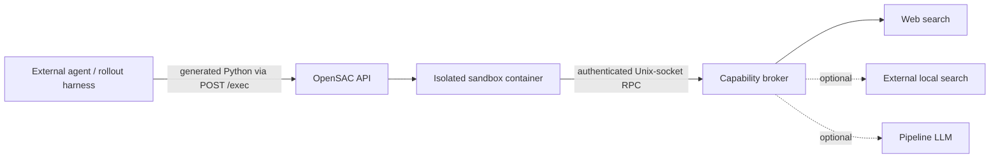

# OpenSAC

**An open, inspectable Search-as-Code runtime for research agents.**

[English](README.md) | [简体中文](README.zh-CN.md)

## TOC

- [Why OpenSAC](#why-opensac)
- [Architecture](#architecture)
- [Quick start](#quick-start)
- [SDK and agent integrations](#sdk-and-agent-integrations)
- [Deployment and development](#deployment-and-development)
- [Documentation](#documentation)
- [Limitations](#limitations)
- [Citation](#citation)
- [License](#license)

OpenSAC lets an external agent express search as a Python program instead of a sequence of fixed
tool calls. The program can batch queries, inspect documents, filter and fuse candidates, extract
structured data, persist intermediate state, and submit cited output. OpenSAC executes it in an
isolated Docker sandbox and mediates every privileged operation through a capability broker.

OpenSAC implements the public
[Search as Code](https://research.perplexity.ai/articles/rethinking-search-as-code-generation)
abstraction. It is not a reconstruction of Perplexity's internal search engine.

> [!IMPORTANT]
> OpenSAC is ongoing work (currently at version `0.4.0`). We are actively developing the system and
> evaluating its effectiveness, with continued updates planned. APIs, deployment contracts, and
> research artifacts may also continue to evolve.

> [!NOTE]
> **Release status:** [`v0.4.0`](https://github.com/liuqi6777/OpenSaC/releases/tag/v0.4.0) is
> available with public, version-matched service and sandbox images on GHCR.

## Why OpenSAC

- **Programmable retrieval** — generated Python can batch, filter, join, rank, and select evidence
  with ordinary control flow.
- **A compact typed SDK** — `opensac_sdk` exposes search, content, state, optional structured LLM,
  usage, and citation primitives.
- **Hardened execution** — sandbox programs have no network, provider credentials, Docker socket,
  or unrestricted host filesystem access.
- **Context decoupling** — large intermediate results remain in the workspace; only explicitly
  printed or submitted data returns to the control model.
- **Traceable evidence** — opaque references and broker-issued passage locators connect candidates
  to final citations.
- **Research instrumentation** — budgets, typed partial failures, traces, phase timings, idempotent
  execution, and worker lifecycle controls support reproducible rollouts.

## Architecture



The Docker deployment has one long-running `opensac` API/broker container. It creates a short-lived,
network-disabled sandbox container for each execution.

<details>
<summary><strong>Research scope and central question</strong></summary>

OpenSAC supports controlled research on a central question:

> When the model, retrieval backend, and evaluation protocol are held constant, does composing
> search primitives in generated code improve quality, context efficiency, or the latency–cost
> trade-off over model-visible tool calls?

OpenSAC deliberately does not own the agent loop. The external control plane selects the model,
generates programs, manages rollouts, and evaluates answers. One rollout should reuse one OpenSAC
session so workspace files and opaque references remain valid across turns. Backend choice,
credentials, retries, rate limits, and resource enforcement stay on the service side.

</details>

## Quick start

The public `v0.4.0` images provide the OpenSAC API/broker and the isolated execution sandbox.

Requirements: Docker Engine or Docker Desktop, a POSIX-compatible shell, and Serper + Jina
credentials.

<details>
<summary><strong>1. Configure and start the Docker service</strong></summary>

Export the runtime configuration:

```bash
export OPENSAC_API_KEY=replace-with-a-long-random-value
export OPENSAC_SERPER_API_KEY=replace-with-serper-key
export OPENSAC_JINA_API_KEY=replace-with-jina-key

export OPENSAC_RUNTIME_DIR="$PWD/opensac-data"
export OPENSAC_DOCKER_SOCKET=/var/run/docker.sock
export OPENSAC_RUN_UID="$(id -u)"
export OPENSAC_RUN_GID="$(id -g)"
if [ "$(uname -s)" = Linux ]; then
  export OPENSAC_DOCKER_GID="$(stat -c '%g' "$OPENSAC_DOCKER_SOCKET")"
else
  export OPENSAC_DOCKER_GID=0
fi
mkdir -p "$OPENSAC_RUNTIME_DIR"
```

Start the published image:

```bash
docker run --detach \
  --name opensac \
  --init \
  --restart unless-stopped \
  --stop-timeout 180 \
  --user "$OPENSAC_RUN_UID:$OPENSAC_RUN_GID" \
  --group-add "$OPENSAC_DOCKER_GID" \
  --env OPENSAC_API_KEY \
  --env OPENSAC_SERPER_API_KEY \
  --env OPENSAC_JINA_API_KEY \
  --env OPENSAC_API_HOST=0.0.0.0 \
  --env OPENSAC_API_PORT=8000 \
  --env OPENSAC_SEARCH_BACKEND=web \
  --env OPENSAC_DATA_DIR="$OPENSAC_RUNTIME_DIR" \
  --env OPENSAC_BROKER_SOCKET="$OPENSAC_RUNTIME_DIR/broker.sock" \
  --env OPENSAC_SANDBOX_IMAGE=ghcr.io/liuqi6777/opensac-sandbox:0.4.0 \
  --publish 127.0.0.1:8000:8000 \
  --mount "type=bind,source=$OPENSAC_RUNTIME_DIR,target=$OPENSAC_RUNTIME_DIR" \
  --mount "type=bind,source=$OPENSAC_DOCKER_SOCKET,target=/var/run/docker.sock,readonly" \
  --read-only \
  --tmpfs /tmp:rw,noexec,nosuid,size=64m \
  --cap-drop ALL \
  --security-opt no-new-privileges:true \
  ghcr.io/liuqi6777/opensac:0.4.0
```

After a few seconds, verify the service without installing a host-side client:

```bash
docker exec opensac python -c \
  "import urllib.request; print(urllib.request.urlopen('http://127.0.0.1:8000/healthz').read().decode())"
```

`docker run` pulls the service image automatically when necessary. The first program execution
pulls the matching sandbox image. The Docker socket lets OpenSAC create short-lived,
network-disabled sandbox containers; treat that access as host-level control and run the service
only under a trusted account.

View logs, stop, or restart the service with:

```bash
docker logs -f opensac
docker stop opensac
docker start opensac
```

The Compose alternative, platform details, upgrades, rollback, and systemd are in the
[deployment guide](docs/deployment.md).

</details>

<details>
<summary><strong>2. Run your first Search-as-Code program</strong></summary>

The service image already contains the Python client. Run this example inside the container; the
generated program itself still executes in a separate, network-disabled sandbox:

```bash
docker exec -i opensac python - <<'PY'
import os

from opensac import OpenSAC

program = """
from opensac_sdk import sdk

hits = sdk.search("Who introduced the ReAct prompting method?", limit=5)
sdk.output.submit({"hits": [hit.model_dump() for hit in hits]})
"""

with OpenSAC(api_key=os.environ["OPENSAC_API_KEY"]) as client:
    session = client.create_session()
    try:
        result = client.exec_code(session["id"], program)
        print(result["output"])
    finally:
        client.delete_session(session["id"])
PY
```

For multi-query fusion, document filtering, persistent JSONL state, and passage citations, see
[examples/research_pipeline.py](examples/research_pipeline.py).

</details>

## SDK and agent integrations

### SDK surface

Generated programs import the singleton with `from opensac_sdk import sdk`.

| Namespace | Main operations | Role |
| --- | --- | --- |
| `sdk.search` | `search`, `many`, `fuse_rrf` | Retrieve and fuse candidates while preserving provenance |
| `sdk.content` | `get_many`, `snippets`, `grep`, `read` | Fetch, locate, and inspect evidence |
| `sdk.llm` | `map`, `map_many`, `extract`, `extract_many` | Optional brokered model calls and schema-checked extraction |
| `sdk.state` | JSON/JSONL and workspace helpers | Persist explicit state across executions in one session |
| `sdk.session` | `usage` | Inspect strategy counts and remaining budgets |
| `sdk.output` | `submit` | Return structured output and resolve trusted citations |

Batch operations preserve input alignment and expose typed per-item failures. Empty search results
are successful results. Passage citations must use locators returned by content operations. The
current public contract and migration notes are in [OpenSAC 0.4](docs/opensac-0.4.md).

### Agent integrations

OpenSAC can be driven through:

1. a custom loop using the HTTP/Python client;
2. `opensac agent-run` plus the CLI Search-as-Code skill;
3. `opensac mcp` plus the MCP skill for Codex or Claude Code.

The public model-facing surface remains one operation, `sac_run(code)`. Conversation binding,
session creation, lease renewal, and state-loss handling stay in the adapter. See the complete
[Agent integration guide](docs/agent-integrations.md) or its
[Chinese version](docs/agent-integrations.zh-CN.md).

## Deployment and development

| Path | Status | Best for |
| --- | --- | --- |
| Docker CLI | Available in `v0.4.0` | Fastest start with no local configuration files |
| Docker Compose | Available in `v0.4.0` | Declarative, repeatable deployment |
| Git source | Available | Development, experiments, and unreleased changes |

<details>
<summary><strong>Published images and versioning</strong></summary>

The `v0.4.0` release publishes multi-architecture Linux images for `amd64` and `arm64`:

- `ghcr.io/liuqi6777/opensac:0.4.0` as the API/broker image;
- `ghcr.io/liuqi6777/opensac-sandbox:0.4.0` as the hardened execution image.

The tag-triggered workflow also updates `latest`, and GitHub creates normal source archives for the
release.

Service and sandbox versions should match. Production deployments should pin an immutable version
or digest rather than `latest`.

</details>

<details>
<summary><strong>Develop from source</strong></summary>

```bash
git clone https://github.com/liuqi6777/OpenSaC.git
cd OpenSaC
uv sync --locked --extra dev
uv run ruff check .
uv run pytest
```

Run `uv run opensac serve` for a foreground source service. Use
`uv run opensac build-sandbox` only when testing unreleased SDK or sandbox changes. The repository
layout and contribution conventions are documented in [AGENTS.md](AGENTS.md).

</details>

## Documentation

| Goal | Document |
| --- | --- |
| Deploy or upgrade OpenSAC | [Deployment](docs/deployment.md) |
| Connect Codex, Claude Code, CLI, or a custom agent | [Agent integrations](docs/agent-integrations.md) |
| Configure the optional local retriever | [Local dense search](docs/local-search.md) |
| Migrate to the current capability contract | [OpenSAC 0.4](docs/opensac-0.4.md) |
| Operate rollout workers | [RL environment workers](docs/rl-environment-workers.md) |
| Publish a version | [Release process](docs/releasing.md) |

## Limitations

- OpenSAC is a research runtime, not a hosted search product or a complete agent framework.
- Real isolation requires Docker; the host-mode example runner is not a security boundary.
- Web retrieval quality, availability, latency, and cost depend on external providers.
- The sandbox reduces risk but does not replace host hardening, authentication, monitoring,
  network controls, or filesystem quotas in a multi-tenant deployment.

## Citation

If OpenSAC supports your research, cite the repository:

```bibtex
@misc{opensac,
  author       = {Qi Liu, Jiaxin Mao},
  title        = {OpenSAC: An Open Search-as-Code System for Deep Research Agents},
  year         = {2026},
  howpublished = {\url{https://github.com/liuqi6777/OpenSaC}},
  note         = {GitHub repository. Corresponding author: Jiaxin Mao}
}
```

Please also cite the original Search-as-Code work when discussing the architecture.

## License

OpenSAC is released under the [MIT License](LICENSE).
