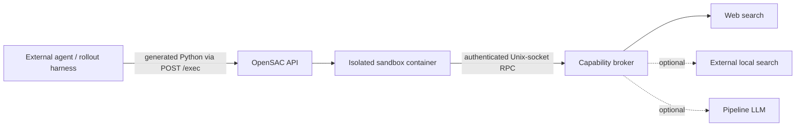

# OpenSAC

**An open, inspectable Search-as-Code runtime for research agents.**

[English](README.md) | [简体中文](README.zh-CN.md)

OpenSAC lets an external agent express search as a Python program instead of a sequence of fixed
tool calls. The program can batch queries, inspect documents, filter and fuse candidates, extract
structured data, persist intermediate state, and submit cited output. OpenSAC executes it in an
isolated Docker sandbox and mediates every privileged operation through a capability broker.

The project supports controlled research on a central question:

> When the model, retrieval backend, and evaluation protocol are held constant, does composing
> search primitives in generated code improve quality, context efficiency, or the latency–cost
> trade-off over model-visible tool calls?

OpenSAC implements the public
[Search as Code](https://research.perplexity.ai/articles/rethinking-search-as-code-generation)
abstraction. It is not a reconstruction of Perplexity's internal search engine.

> [!IMPORTANT]
> OpenSAC is an active research prototype (version `0.4.0`). APIs, deployment contracts, and
> research artifacts may continue to evolve.

> [!WARNING]
> **Release status:** the `v0.4.0` Git tag does not exist yet, and the GHCR service images are not
> publicly available. The Docker release workflow and Compose files are prepared, but the
> currently usable installation path is a source checkout. PyPI publication is not planned.

## Why OpenSAC

- **Programmable retrieval** — generated Python can batch, filter, join, rank, and select evidence
  with ordinary control flow.
- **A compact typed SDK** — `opensac_sdk` exposes search, content, state, optional structured LLM,
  usage, and citation primitives.
- **Hardened execution** — sandbox programs have no network, provider credentials, Docker socket,
  or unrestricted host filesystem access.
- **Context decoupling** — large intermediate results remain in the workspace; only explicitly
  printed or submitted data returns to the control model.
- **Traceable evidence** — opaque references and broker-issued passage locators connect candidates
  to final citations.
- **Research instrumentation** — budgets, typed partial failures, traces, phase timings, idempotent
  execution, and worker lifecycle controls support reproducible rollouts.

## Architecture



OpenSAC deliberately does not own the agent loop. The external control plane selects the model,
generates programs, manages rollouts, and evaluates answers. One rollout should reuse one OpenSAC
session so workspace files and opaque references remain valid across turns. Backend choice,
credentials, retries, rate limits, and resource enforcement stay on the service side.

The default Compose deployment has one long-running `opensac` API/broker container. It creates a
short-lived, network-disabled sandbox container for each execution. It intentionally contains no
`local_search` service.

## Quick start from source

This is the currently usable path before the first public release. It uses web search and does not
start the optional local retriever.

Requirements: Python 3.12+, [`uv`](https://docs.astral.sh/uv/), Docker Engine or Docker Desktop,
and Serper + Jina credentials.

### 1. Install and configure

```bash
git clone https://github.com/liuqi6777/OpenSaC.git
cd OpenSaC
uv sync --locked --extra dev
cp .env.example .env
```

Set these values in `.env`:

```bash
OPENSAC_API_KEY=replace-with-a-long-random-value
OPENSAC_SEARCH_BACKEND=web
OPENSAC_SERPER_API_KEY=replace-with-serper-key
OPENSAC_JINA_API_KEY=replace-with-jina-key
```

Do not commit `.env`. Provider credentials stay in the API container and are never passed to
generated programs.

### 2. Build the sandbox and start the service

```bash
uv run opensac build-sandbox
uv run opensac serve
```

The service stays in the foreground. In another terminal:

```bash
curl -fsS http://127.0.0.1:8000/healthz
```

Platform details, upgrades, rollback, systemd, and the prepared Compose deployment are in the
[deployment guide](docs/deployment.md). Local dense retrieval remains available as an external,
advanced backend; see [Local dense search](docs/local-search.md).

## Run a Search-as-Code program

Run the client from the source environment and export the same API key used by the service:

```bash
export OPENSAC_API_KEY=replace-with-the-same-api-key
uv run python
```

At the Python prompt, or in a file executed with `uv run python FILE.py`, create one session,
execute a generated-style program, and delete the session:

```python
import os

from opensac import OpenSAC

program = """
from opensac_sdk import sdk

hits = sdk.search("Who introduced the ReAct prompting method?", limit=5)
sdk.output.submit({"hits": [hit.model_dump() for hit in hits]})
"""

with OpenSAC(api_key=os.environ["OPENSAC_API_KEY"]) as client:
    session = client.create_session()
    try:
        result = client.exec_code(session["id"], program)
        print(result["output"])
    finally:
        client.delete_session(session["id"])
```

For multi-query fusion, document filtering, persistent JSONL state, and passage citations, see
[examples/research_pipeline.py](examples/research_pipeline.py).

## Installation and release status

| Path | Status | Best for |
| --- | --- | --- |
| Git checkout | Available now | Development, experiments, and current deployments |
| Docker Compose | Prepared; usable after public images are published | Prebuilt service deployment |

The tag-triggered release workflow is configured to publish:

- `ghcr.io/liuqi6777/opensac:X.Y.Z` as the API/broker image;
- `ghcr.io/liuqi6777/opensac-sandbox:X.Y.Z` as the hardened execution image.

GitHub also creates the normal source archives for the tagged release. The workflow does not
publish or attach Python package distributions.

Service and sandbox versions should match. Production deployments should pin an immutable version
or digest rather than `latest`. Until those artifacts exist, do not use the GHCR commands as
installation instructions.

## SDK surface

Generated programs import the singleton with `from opensac_sdk import sdk`.

| Namespace | Main operations | Role |
| --- | --- | --- |
| `sdk.search` | `search`, `many`, `fuse_rrf` | Retrieve and fuse candidates while preserving provenance |
| `sdk.content` | `get_many`, `snippets`, `grep`, `read` | Fetch, locate, and inspect evidence |
| `sdk.llm` | `map`, `map_many`, `extract`, `extract_many` | Optional brokered model calls and schema-checked extraction |
| `sdk.state` | JSON/JSONL and workspace helpers | Persist explicit state across executions in one session |
| `sdk.session` | `usage` | Inspect strategy counts and remaining budgets |
| `sdk.output` | `submit` | Return structured output and resolve trusted citations |

Batch operations preserve input alignment and expose typed per-item failures. Empty search results
are successful results. Passage citations must use locators returned by content operations. The
current public contract and migration notes are in [OpenSAC 0.4](docs/opensac-0.4.md).

## Agent integrations

OpenSAC can be driven through:

1. a custom loop using the HTTP/Python client;
2. `opensac agent-run` plus the CLI Search-as-Code skill;
3. `opensac mcp` plus the MCP skill for Codex or Claude Code.

The public model-facing surface remains one operation, `sac_run(code)`. Conversation binding,
session creation, lease renewal, and state-loss handling stay in the adapter. See the complete
[Agent integration guide](docs/agent-integrations.md) or its
[Chinese version](docs/agent-integrations.zh-CN.md).

## Develop from source

```bash
git clone https://github.com/liuqi6777/OpenSaC.git
cd OpenSaC
uv sync --locked --extra dev
uv run ruff check .
uv run pytest
```

Run `uv run opensac serve` for a foreground source service. Use
`uv run opensac build-sandbox` only when testing unreleased SDK or sandbox changes. The repository
layout and contribution conventions are documented in [AGENTS.md](AGENTS.md).

## Documentation

| Goal | Document |
| --- | --- |
| Deploy or upgrade OpenSAC | [Deployment](docs/deployment.md) |
| Connect Codex, Claude Code, CLI, or a custom agent | [Agent integrations](docs/agent-integrations.md) |
| Configure the optional local retriever | [Local dense search](docs/local-search.md) |
| Understand the architecture and research boundary | [Design goals and roadmap](docs/design.md) |
| Migrate to the current capability contract | [OpenSAC 0.4](docs/opensac-0.4.md) |
| Operate rollout workers | [RL environment workers](docs/rl-environment-workers.md) |
| Inspect research metrics and traces | [Research instrumentation](docs/research-instrumentation.md) |
| Publish a version | [Release process](docs/releasing.md) |

## Limitations

- OpenSAC is a research runtime, not a hosted search product or a complete agent framework.
- Real isolation requires Docker; the host-mode example runner is not a security boundary.
- Web retrieval quality, availability, latency, and cost depend on external providers.
- The sandbox reduces risk but does not replace host hardening, authentication, monitoring,
  network controls, or filesystem quotas in a multi-tenant deployment.

## Citation

If OpenSAC supports your research, cite the repository while the paper is under review:

```bibtex
@software{liu2026opensac,
  author  = {Qi Liu},
  title   = {OpenSAC: An Open Implementation of Search as Code},
  year    = {2026},
  url     = {https://github.com/liuqi6777/OpenSaC},
  version = {0.4.0}
}
```

Please also cite the original Search-as-Code work when discussing the architecture.

## License

OpenSAC is released under the [MIT License](LICENSE).
