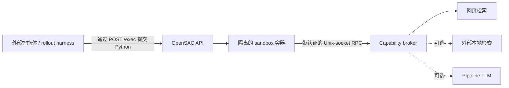

# OpenSAC

**面向研究型智能体的开放、可审计 Search-as-Code 运行时。**

[English](README.md) | [简体中文](README.zh-CN.md)

OpenSAC 让外部智能体用 Python 程序表达搜索策略，而不是连续调用一组固定工具。程序可以批量检索、阅读
正文、过滤与融合候选、结构化抽取、持久化中间状态并提交带引用的输出。OpenSAC 在隔离的 Docker 沙箱
中执行程序，所有特权操作统一由 capability broker 代理。

本项目用于研究一个核心问题：

> 在控制模型、检索后端和评测协议保持一致时，让模型用生成的代码组合搜索原语，相比使用模型可见的
> 工具调用，能否提升质量、上下文效率，或改善延迟—成本权衡？

OpenSAC 实现了公开的
[Search as Code](https://research.perplexity.ai/articles/rethinking-search-as-code-generation)
抽象，但并不试图复刻 Perplexity 的内部搜索引擎。

> [!IMPORTANT]
> OpenSAC 目前是持续开发中的研究原型（版本 `0.4.0`），API、部署契约和研究材料仍可能继续演进。

> [!WARNING]
> **发布状态：**`v0.4.0` Git 标签尚不存在，GHCR 服务镜像也无法公开拉取。Docker 发布工作流和
> Compose 文件已经准备好，但当前真正可用的安装方式仍是源码检出；项目不计划发布 PyPI 包。

## 为什么使用 OpenSAC

- **可编程检索**：生成的 Python 可以用普通控制流完成批量查询、过滤、关联、排序和证据选择。
- **紧凑的类型化 SDK**：`opensac_sdk` 提供搜索、正文、状态、可选结构化 LLM、用量和引用原语。
- **强化隔离执行**：沙箱程序无法访问网络、服务商密钥、Docker socket 或不受限的宿主机文件系统。
- **上下文解耦**：大规模中间结果保留在工作空间中，只有程序明确打印或提交的数据返回控制模型。
- **可追踪证据**：会话级不透明引用与 broker 签发的段落 locator 将候选结果连接到最终引用。
- **研究级观测**：预算、类型化局部失败、trace、阶段耗时、幂等执行和 worker 生命周期支持可复现 rollout。

## 架构



OpenSAC 有意不负责 agent loop。外部控制平面选择模型、生成程序、管理 rollout 并评测答案。每个 rollout
应复用同一个 OpenSAC session，使工作空间文件和不透明引用可以跨轮次使用。后端选择、密钥、重试、
限流和资源约束全部保留在服务端。

默认 Compose 部署只有一个常驻的 `opensac` API/broker 容器，每次执行时再创建短生命周期、无网络的
sandbox 容器。Compose 刻意不包含 `local_search` 服务。

## 从源码快速开始

这是首次公开发布前真正可用的方式。它使用网页检索，不会启动可选的本地检索器。

环境要求：Python 3.12+、[`uv`](https://docs.astral.sh/uv/)、Docker Engine 或 Docker Desktop，
以及 Serper + Jina 凭证。

### 1. 安装并配置

```bash
git clone https://github.com/liuqi6777/OpenSaC.git
cd OpenSaC
uv sync --locked --extra dev
cp .env.example .env
```

在 `.env` 中设置：

```bash
OPENSAC_API_KEY=replace-with-a-long-random-value
OPENSAC_SEARCH_BACKEND=web
OPENSAC_SERPER_API_KEY=replace-with-serper-key
OPENSAC_JINA_API_KEY=replace-with-jina-key
```

不要提交 `.env`。服务商凭证只保留在 API 容器中，不会传递给生成程序。

### 2. 构建沙箱并启动服务

```bash
uv run opensac build-sandbox
uv run opensac serve
```

服务会保持前台运行。在另一个终端中执行：

```bash
curl -fsS http://127.0.0.1:8000/healthz
```

不同平台参数、升级回滚、systemd 和已经准备好的 Compose 部署见[部署指南](docs/deployment.md)。
本地稠密检索仍可作为外部高级后端使用，详见[本地稠密检索](docs/local-search.md)。

## 执行 Search-as-Code 程序

在源码环境中运行客户端，并导出与服务端相同的 API key：

```bash
export OPENSAC_API_KEY=replace-with-the-same-api-key
uv run python
```

在 Python 提示符中，或把下面代码保存后通过 `uv run python FILE.py` 执行：

```python
import os

from opensac import OpenSAC

program = """
from opensac_sdk import sdk

hits = sdk.search("谁提出了 ReAct prompting 方法？", limit=5)
sdk.output.submit({"hits": [hit.model_dump() for hit in hits]})
"""

with OpenSAC(api_key=os.environ["OPENSAC_API_KEY"]) as client:
    session = client.create_session()
    try:
        result = client.exec_code(session["id"], program)
        print(result["output"])
    finally:
        client.delete_session(session["id"])
```

包含多查询融合、正文过滤、JSONL 持久化状态和段落引用的完整示例见
[examples/research_pipeline.py](examples/research_pipeline.py)。

## 安装与发布状态

| 方式 | 状态 | 适用场景 |
| --- | --- | --- |
| Git 源码检出 | 当前可用 | 开发、实验和当前部署 |
| Docker Compose | 已准备；公开镜像发布后可用 | 预构建服务部署 |

标签触发的发布工作流已配置为发布：

- API/broker 镜像 `ghcr.io/liuqi6777/opensac:X.Y.Z`；
- 强化执行镜像 `ghcr.io/liuqi6777/opensac-sandbox:X.Y.Z`。

GitHub 会为标签生成常规源码归档；工作流不会发布或附加 Python package distribution。

服务镜像和沙箱镜像的版本应保持一致。生产环境应固定不可变版本或 digest，不要依赖 `latest`。
在这些产物真正存在之前，不应把 GHCR 命令当作可用安装方式。

## SDK 接口

生成程序通过 `from opensac_sdk import sdk` 导入单例。

| 命名空间 | 主要操作 | 作用 |
| --- | --- | --- |
| `sdk.search` | `search`、`many`、`fuse_rrf` | 检索并融合候选，同时保留 provenance |
| `sdk.content` | `get_many`、`snippets`、`grep`、`read` | 获取、定位和检查证据 |
| `sdk.llm` | `map`、`map_many`、`extract`、`extract_many` | 可选的 broker 模型调用与 schema 校验抽取 |
| `sdk.state` | JSON/JSONL 与工作空间辅助方法 | 在同一 session 的多次执行间持久化显式状态 |
| `sdk.session` | `usage` | 查看策略统计与剩余预算 |
| `sdk.output` | `submit` | 返回结构化输出并解析可信引用 |

批量操作保持输入对齐，并暴露类型化的逐项失败。空搜索结果属于成功结果。段落引用必须使用正文操作返回的
locator。当前公共契约与迁移说明见 [OpenSAC 0.4](docs/opensac-0.4.md)。

## 智能体集成

OpenSAC 支持三种驱动方式：

1. 自定义 agent loop，通过 HTTP/Python 客户端调用；
2. `opensac agent-run` 配合 CLI 版 Search-as-Code skill；
3. `opensac mcp` 配合 Codex 或 Claude Code 的 MCP skill。

模型可见的公开接口仍只有 `sac_run(code)`。对话绑定、session 创建、lease 续租和状态丢失处理全部留在
适配层。完整配置见[智能体集成指南](docs/agent-integrations.zh-CN.md)或
[英文版](docs/agent-integrations.md)。

## 从源码开发

```bash
git clone https://github.com/liuqi6777/OpenSaC.git
cd OpenSaC
uv sync --locked --extra dev
uv run ruff check .
uv run pytest
```

运行 `uv run opensac serve` 可启动前台源码服务。只有测试尚未发布的 SDK 或沙箱改动时，才需要运行
`uv run opensac build-sandbox`。仓库结构和贡献约定见 [AGENTS.md](AGENTS.md)。

## 文档

| 目标 | 文档 |
| --- | --- |
| 部署或升级 OpenSAC | [部署指南](docs/deployment.md) |
| 连接 Codex、Claude Code、CLI 或自定义智能体 | [智能体集成](docs/agent-integrations.zh-CN.md) |
| 配置可选的本地检索器 | [本地稠密检索](docs/local-search.md) |
| 理解架构和研究边界 | [设计目标与路线图](docs/design.md) |
| 迁移到当前能力契约 | [OpenSAC 0.4](docs/opensac-0.4.md) |
| 运行 rollout worker | [RL environment workers](docs/rl-environment-workers.md) |
| 查看研究指标与 trace | [研究观测](docs/research-instrumentation.md) |
| 发布正式版本 | [版本发布流程](docs/releasing.zh-CN.md) |

## 局限性

- OpenSAC 是研究运行时，不是托管搜索产品，也不是完整的智能体框架。
- 真正的隔离依赖 Docker；宿主机模式示例 runner 不构成安全边界。
- 网页检索的质量、可用性、延迟和成本依赖外部服务商。
- 沙箱只能降低风险；多租户部署仍需宿主机加固、认证、监控、网络控制和文件系统配额。

## 引用

论文送审期间，如果 OpenSAC 对你的研究有帮助，请引用本仓库：

```bibtex
@software{liu2026opensac,
  author  = {Qi Liu},
  title   = {OpenSAC: An Open Implementation of Search as Code},
  year    = {2026},
  url     = {https://github.com/liuqi6777/OpenSaC},
  version = {0.4.0}
}
```

讨论该架构时，也请引用最初的 Search-as-Code 工作。

## 许可证

OpenSAC 使用 [MIT License](LICENSE) 发布。
